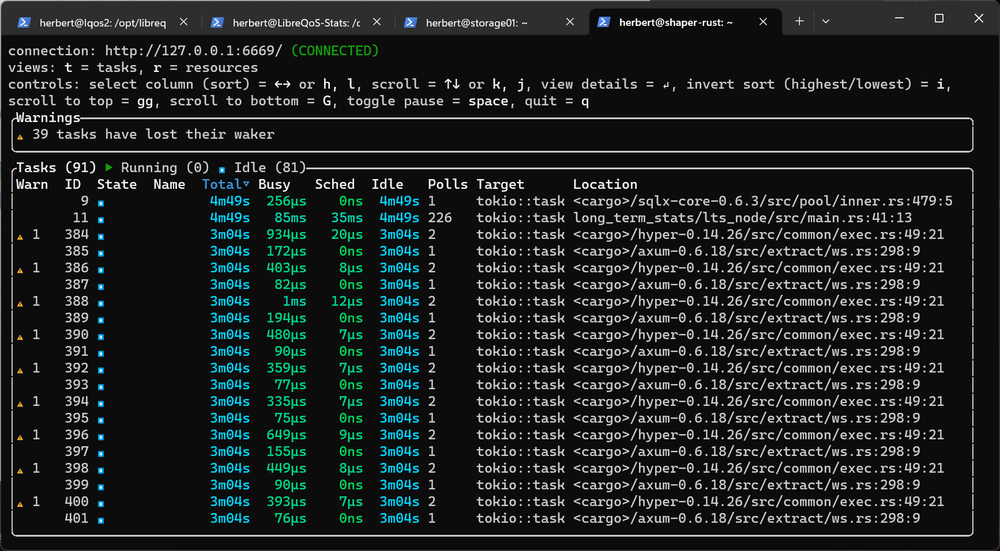
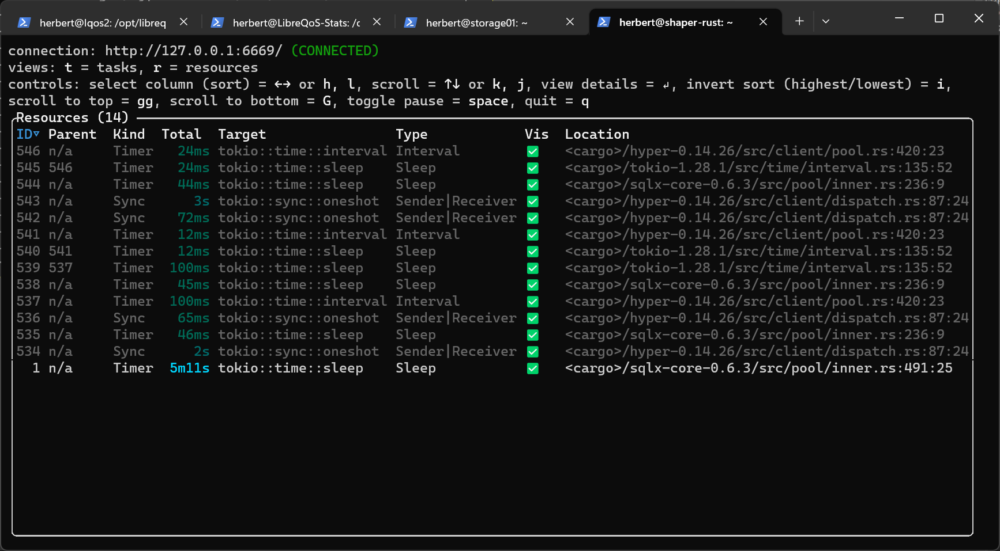
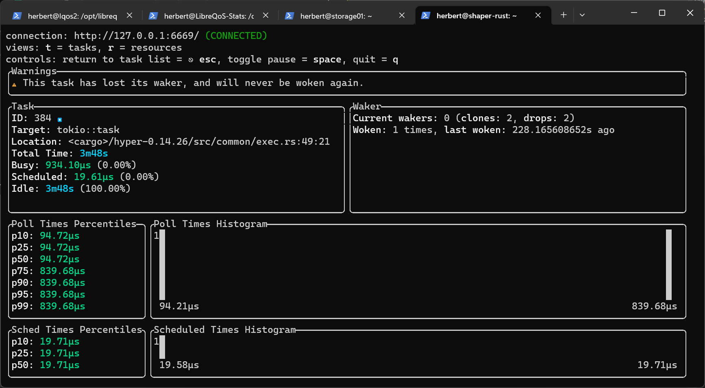

# Tracing (and logging)

Add the following dependencies:

```bash
cargo add tokio -F full
cargo add tracing
cargo add tracing-subscriber
```

> Tracing works without async and Tokio. We'll be using it with async later, so we're adding those dependencies now.

## Subscribing to Trace Events and Logging

The most basic usage is for logging. The following program gets you a minimal logging framework:

```rust
#[tokio::main]
async fn main() {
    let subscriber = tracing_subscriber::FmtSubscriber::new();
    tracing::subscriber::set_global_default(subscriber).unwrap();

    tracing::info!("Hello World!");
    tracing::warn!("Hello World!");
    tracing::error!("Hello World!");
}
```

This will output:

```
2023-07-20T17:50:03.067756Z  INFO tokio_tracing: Hello World!
2023-07-20T17:50:03.067920Z  WARN tokio_tracing: Hello World!
2023-07-20T17:50:03.068006Z ERROR tokio_tracing: Hello World!
```

That's nice (and colorful in a console that supports it), but it would be nice to have some more information. We can replace the `FmtSubscriber::new()` with a builder-pattern builder to heavily customize output:

```rust
let subscriber = tracing_subscriber::fmt()
    // Use a more compact, abbreviated log format
    .compact()
    // Display source code file paths
    .with_file(true)
    // Display source code line numbers
    .with_line_number(true)
    // Display the thread ID an event was recorded on
    .with_thread_ids(true)
    // Don't display the event's target (module path)
    .with_target(false)
    // Build the subscriber
    .finish();
```

Now you get a bit more insight into where the log messages are coming from:

```
2023-07-20T17:53:42.283322Z  INFO ThreadId(01) tokio_tracing\src\main.rs:22: Hello World!
2023-07-20T17:53:42.283502Z  WARN ThreadId(01) tokio_tracing\src\main.rs:23: Hello World!
2023-07-20T17:53:42.283699Z ERROR ThreadId(01) tokio_tracing\src\main.rs:24: Hello World!
```

## Tracing Spans

That's a great start, but wouldn't it be nice to get some performance indications?

Include this in your `use` statements:

```rust
use tracing_subscriber::fmt::format::FmtSpan;
```

And add another entry to the subscriber builder:

```rust
// Add span events
.with_span_events(FmtSpan::ENTER | FmtSpan::CLOSE)
```

Now we'll make a function, and decorate it with `#[instrument]`:

```rust
#[tracing::instrument]
fn do_something() {
    tracing::info!("Doing something");
}
```

Finally, we'll add a call to the instrumented function:

```rust
do_something();
```

Running the program now gives us some performance data:

```
2023-07-20T17:57:14.201166Z  INFO ThreadId(01) do_something: tokio_tracing\src\main.rs:33: enter
2023-07-20T17:57:14.201334Z  INFO ThreadId(01) do_something: tokio_tracing\src\main.rs:35: Doing something
2023-07-20T17:57:14.201467Z  INFO ThreadId(01) do_something: tokio_tracing\src\main.rs:33: close time.busy=286µs time.idle=37.0µs
```

You can keep adding functions. For example:

```rust
#[tracing::instrument]
fn do_something() {
    tracing::info!("Doing something");
    for n in 0..3 {
        do_something_else(n);
    }
}

#[tracing::instrument]
fn do_something_else(n: i32) {
    tracing::info!("Doing something else: {n}");
}
```

Gives you detailed output regarding each child call, as well as the parent call:

```
2023-07-20T18:00:46.121875Z  INFO ThreadId(01) do_something: tokio_tracing\src\main.rs:33: enter
2023-07-20T18:00:46.122054Z  INFO ThreadId(01) do_something: tokio_tracing\src\main.rs:35: Doing something
2023-07-20T18:00:46.122227Z  INFO ThreadId(01) do_something:do_something_else: tokio_tracing\src\main.rs:41: enter n=0
2023-07-20T18:00:46.122375Z  INFO ThreadId(01) do_something:do_something_else: tokio_tracing\src\main.rs:43: Doing something else: 0 n=0
2023-07-20T18:00:46.122540Z  INFO ThreadId(01) do_something:do_something_else: tokio_tracing\src\main.rs:41: close time.busy=311µs time.idle=5.20µs n=0
2023-07-20T18:00:46.122790Z  INFO ThreadId(01) do_something:do_something_else: tokio_tracing\src\main.rs:41: enter n=1
2023-07-20T18:00:46.122916Z  INFO ThreadId(01) do_something:do_something_else: tokio_tracing\src\main.rs:43: Doing something else: 1 n=1
2023-07-20T18:00:46.123041Z  INFO ThreadId(01) do_something:do_something_else: tokio_tracing\src\main.rs:41: close time.busy=250µs time.idle=3.90µs n=1
2023-07-20T18:00:46.123244Z  INFO ThreadId(01) do_something:do_something_else: tokio_tracing\src\main.rs:41: enter n=2
2023-07-20T18:00:46.123361Z  INFO ThreadId(01) do_something:do_something_else: tokio_tracing\src\main.rs:43: Doing something else: 2 n=2
2023-07-20T18:00:46.123473Z  INFO ThreadId(01) do_something:do_something_else: tokio_tracing\src\main.rs:41: close time.busy=229µs time.idle=3.20µs n=2
2023-07-20T18:00:46.123822Z  INFO ThreadId(01) do_something: tokio_tracing\src\main.rs:33: close time.busy=1.94ms time.idle=23.0µs
```

It's not a formal benchmark, but it's great for quick performance checks.

### Async Spans

Let's add an async function:

```rust

#[tracing::instrument]
async fn do_something_async() {
    tracing::info!("We're in an async context");
    tokio::time::sleep(std::time::Duration::from_secs(1)).await;
    tracing::info!("Finished waiting");
}
```

And call it from main:

```rust
do_something_async().await;
```

You get the following output:

```
2023-07-20T18:04:44.150288Z  INFO ThreadId(01) do_something_async: tokio_tracing\src\main.rs:47: enter
2023-07-20T18:04:44.150405Z  INFO ThreadId(01) do_something_async: tokio_tracing\src\main.rs:49: We're in an async context
2023-07-20T18:04:45.153037Z  INFO ThreadId(01) do_something_async: tokio_tracing\src\main.rs:47: enter
2023-07-20T18:04:45.153248Z  INFO ThreadId(01) do_something_async: tokio_tracing\src\main.rs:51: Finished waiting
2023-07-20T18:04:45.153378Z  INFO ThreadId(01) do_something_async: tokio_tracing\src\main.rs:47: close time.busy=630µs time.idle=1.00s
```

Notice how it lists `idle=1.00s`? Tracing is smart enough to list "idle" time as time awaiting something else. So you can get a good gauge of how much time you are spending waiting on async processes.

## Axum Integration

We'll switch to a new project, `axum_tracing`. Let's add some dependencies:

```bash
cargo add tokio -F full
cargo add axum
cargo add tower_http -F full
```

Note that we've added the `tracing` feature.

And we'll build the basic hello world service again:

```rust
use axum::{routing::get, Router};
use std::net::SocketAddr;

#[tokio::main]
async fn main() {
    let app = Router::new().route("/", get(say_hello_text));
    let addr = SocketAddr::from(([127, 0, 0, 1], 3000));
    axum::Server::bind(&addr)
        .serve(app.into_make_service())
        .await
        .unwrap();
}

async fn say_hello_text() -> &'static str {
    "Hello, world!"
}
```

As before, it displays "Hello, world!" in a boring page. Now, we'll add a tracing subscriber:

```bash
cargo add tracing
cargo add tracing-subscriber
```

And initialize our subscriber at the beginning of the program:

```rust
use tracing_subscriber::fmt::format::FmtSpan;
let subscriber = tracing_subscriber::fmt()
    // Use a more compact, abbreviated log format
    .compact()
    // Display source code file paths
    .with_file(true)
    // Display source code line numbers
    .with_line_number(true)
    // Display the thread ID an event was recorded on
    .with_thread_ids(true)
    // Don't display the event's target (module path)
    .with_target(false)
    // Add span events
    .with_span_events(FmtSpan::ENTER | FmtSpan::CLOSE)
    // Display debug-level info
    .with_max_level(tracing_subscriber::filter::LevelFilter::DEBUG)
    // Build the subscriber
    .finish();

tracing::subscriber::set_global_default(subscriber).unwrap();
```

Notice that we've added `with_max_level` to display "debug" level events. There are a LOT of those!

Finally, we add a layer to our router handler:

```rust
let app = Router::new()
    .route("/", get(say_hello_text))
    .layer(TraceLayer::new_for_http());
```

Using the "tower" service manager, we are now subscribed to all of its tracing events. You get a LOT of output:

```
2023-07-20T18:38:03.384687Z DEBUG ThreadId(21) C:\Users\Herbert\.cargo\registry\src\index.crates.io-6f17d22bba15001f\hyper-0.14.27\src\proto\h1\io.rs:207: parsed 12 headers
2023-07-20T18:38:03.385045Z DEBUG ThreadId(21) C:\Users\Herbert\.cargo\registry\src\index.crates.io-6f17d22bba15001f\hyper-0.14.27\src\proto\h1\conn.rs:222: incoming body is empty
2023-07-20T18:38:03.385607Z DEBUG ThreadId(21) request: C:\Users\Herbert\.cargo\registry\src\index.crates.io-6f17d22bba15001f\tower-http-0.4.3\src\trace\make_span.rs:109: enter method=GET uri=/ version=HTTP/1.1
2023-07-20T18:38:03.385852Z DEBUG ThreadId(21) request: C:\Users\Herbert\.cargo\registry\src\index.crates.io-6f17d22bba15001f\tower-http-0.4.3\src\trace\on_request.rs:80: started processing request method=GET uri=/ version=HTTP/1.1
2023-07-20T18:38:03.386088Z DEBUG ThreadId(21) request: C:\Users\Herbert\.cargo\registry\src\index.crates.io-6f17d22bba15001f\tower-http-0.4.3\src\trace\make_span.rs:109: enter method=GET uri=/ version=HTTP/1.1
2023-07-20T18:38:03.386356Z DEBUG ThreadId(21) request: C:\Users\Herbert\.cargo\registry\src\index.crates.io-6f17d22bba15001f\tower-http-0.4.3\src\trace\on_response.rs:114: finished processing request latency=0 ms status=200 method=GET uri=/ version=HTTP/1.1
2023-07-20T18:38:03.386663Z DEBUG ThreadId(21) request: C:\Users\Herbert\.cargo\registry\src\index.crates.io-6f17d22bba15001f\tower-http-0.4.3\src\trace\make_span.rs:109: enter method=GET uri=/ version=HTTP/1.1
2023-07-20T18:38:03.386992Z DEBUG ThreadId(21) request: C:\Users\Herbert\.cargo\registry\src\index.crates.io-6f17d22bba15001f\tower-http-0.4.3\src\trace\make_span.rs:109: close time.busy=1.21ms time.idle=223µs method=GET uri=/ version=HTTP/1.1
2023-07-20T18:38:03.387581Z DEBUG ThreadId(21) C:\Users\Herbert\.cargo\registry\src\index.crates.io-6f17d22bba15001f\hyper-0.14.27\src\proto\h1\io.rs:320: flushed 130 bytes
2023-07-20T18:38:03.429555Z DEBUG ThreadId(04) C:\Users\Herbert\.cargo\registry\src\index.crates.io-6f17d22bba15001f\hyper-0.14.27\src\proto\h1\io.rs:207: parsed 11 headers
2023-07-20T18:38:03.429995Z DEBUG ThreadId(04) C:\Users\Herbert\.cargo\registry\src\index.crates.io-6f17d22bba15001f\hyper-0.14.27\src\proto\h1\conn.rs:222: incoming body is empty
2023-07-20T18:38:03.430240Z DEBUG ThreadId(04) C:\Users\Herbert\.cargo\registry\src\index.crates.io-6f17d22bba15001f\hyper-0.14.27\src\server\server.rs:765: connection error: connection closed before message completed
```

If you need to debug your webserver, this gives you a lot of information. Let's change output level to `info`:

```rust
.with_max_level(tracing_subscriber::filter::LevelFilter::INFO)
```

Running the program gives us no output at all! Fortunately, you can do quite fine-grained configuration of the Tower HTTP trace output as follows:

```rust
// Axum App
use tower_http::trace::{self, TraceLayer};
let app = Router::new().route("/", get(say_hello_text)).layer(
    TraceLayer::new_for_http()
        .on_response(trace::DefaultOnResponse::new().level(tracing::Level::INFO)),
);
```

Now running your program gives you some useful information, but not a flood:

```
2023-07-20T18:48:23.845380Z  INFO ThreadId(21) C:\Users\Herbert\.cargo\registry\src\index.crates.io-6f17d22bba15001f\tower-http-0.4.3\src\trace\on_response.rs:114: finished processing request latency=0 ms status=200
```

## Logging Targets/Format

For automated log ingestion, you can change the output format. Update your subscriber dependency to include the `json` feature:

```toml
tracing-subscriber = { version = "0.3.17", features = [ "json" ] }
```

And you can initialize a logger with JSON format:

```rust
let subscriber = tracing_subscriber::fmt()
        .json()
        // Display source code file paths
        .with_file(true)
        // Display source code line numbers
        .with_line_number(true)
        // Display the thread ID an event was recorded on
        .with_thread_ids(true)
        // Don't display the event's target (module path)
        .with_target(false)
        // Add span events
        .with_span_events(FmtSpan::ENTER | FmtSpan::CLOSE)
        // Build the subscriber
        .finish();
```

You can use the `tracing-appender` crate to write to log files (including with rollover). 

It's still in-progress, but you can link to OpenTelemetry [with this crate](https://docs.rs/tracing-opentelemetry/latest/tracing_opentelemetry/)

> Note that many crates implement this tracing system. SQLX will provide you with query timings, for example.

## Tokio Console

If you'd like an `htop` style view of what your async application is doing in real-time, `tokio-console` can provide it.

You can install `tokio-console` with `cargo install tokio-console`. Then you have to add a configuration option to `Cargo.toml`:

```toml
[build]
rustflags = ["--cfg", "tokio_unstable"]
```

> If you're using a workspace, the *parent* `Cargo.toml` controls all builds. You'll need to set it there. You can also set the environment variable `RUSTFLAGS` to equal `--cfg tokio_unstable` when you run the build.

In your application, add a dependency to `console_subscriber` with `cargo add console_subscriber`. Finally, while you setup your application add a call to:

```rust
console_subscriber::init();
```

Now you can run `tokio-console` from the command line, and it will show you a real-time view of your async application's execution.

The top-level tasks view shows you all of the async tasks in your application:



The resources view shows you shared resources that are being polled:



And you can select a task for specific information:



