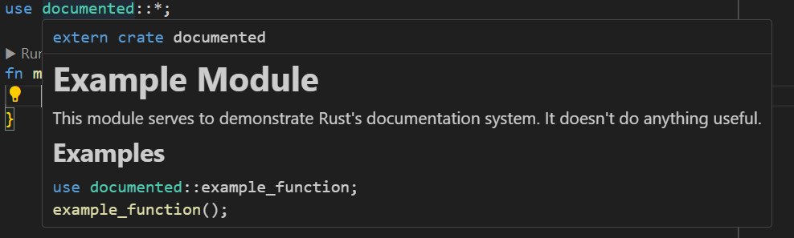
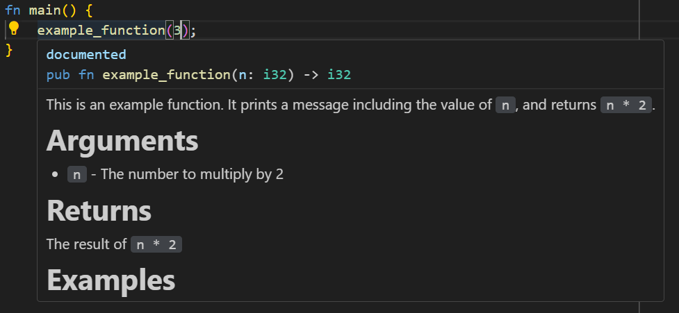
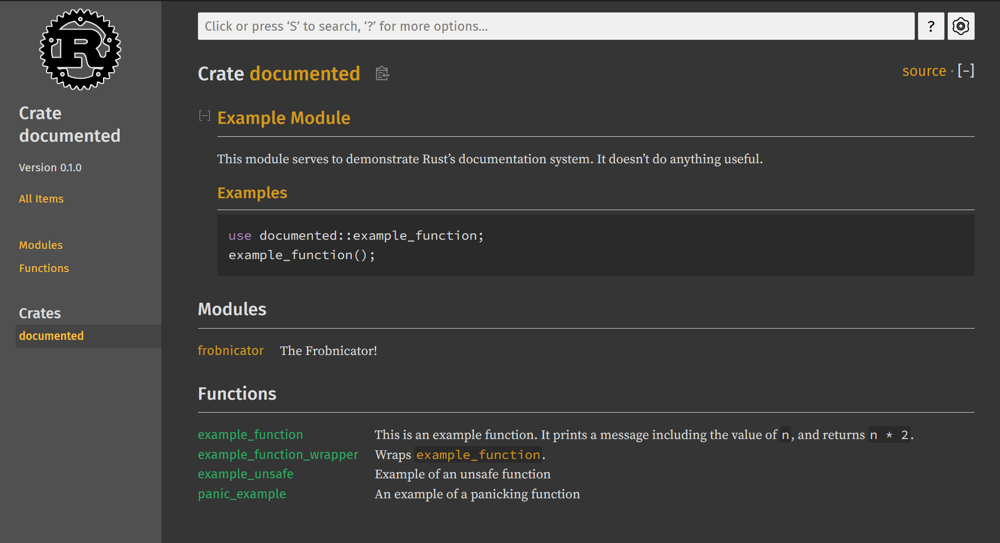

# Document Your Code

If you're working with anyone else---or even your future self---documentation is a good idea. Rust has a built-in documentation system that is very easy to use. It's also very easy to publish your documentation to the web.

When you're writing a library, you should document every public function and structure. You should also provide module documentation. This is a good habit to get into, even if you're not writing a library.

If you're using an IDE that integrates with a Rust Language Server, documentation will automatically appear in your tooltips. This makes it easy for others to learn to use your code.

## Documented Library

A good way to make sure you don't miss some documentation is to add the warning to the top of your crate:

```rust
#![warn(missing_docs)]
```

> There's an ongoing debate as to whether this should be enabled by default!

### Scope-Level Documentation

The top of your library (and each public module) should have a documentation comment. The `//!` syntax indicates a scope-level comment. This is where you should describe the purpose of the library, and any other information that is relevant to the entire library.

```rust
//! # Example Module
//! 
//! This module serves to demonstrate Rust's documentation system. It doesn't do anything useful.
//!
//! ## Examples
//! 
//! ```
//! use documented::example_function;
//! example_function();
//! ```
```

Ideally, you want to include:
* What the library does and why you want to use it
* Some examples of how to use it

Now when you use the library, the library includes a nice tooltip describing how to use it:



You've also included your documentation in your tests (like we talked about in [Unit Tests](../Day3/UnitTesting.md)). This means that your documentation is tested every time you run your tests with `cargo test`. This makes it harder to forget to update the documentation!

### Function-Level Documentation

You should also document every public function and structure. This is done with the `///` syntax. You should include:
* What the function does
* What the parameters are
* What the return value is (if any)
* Any errors that can be returned
* Examples of how to use the function

Here's a fully documented---but quite useless---function:

```rust
/// This is an example function. It prints a message including the value
/// of `n`, and returns `n * 2`.
/// 
/// # Arguments
/// 
/// * `n` - The number to multiply by 2
/// 
/// # Returns
/// 
/// The result of `n * 2`
/// 
/// # Examples
/// 
/// ```
/// assert_eq!(documented::example_function(2), 4);
/// ```
pub fn example_function(n: i32) -> i32 {
    println!("This is an example function. n = {n}");
    n * 2
}
```

Once again, you've baked a unit test into your documentation. You've also got a nice tooltip for consumers:



If your function uses any `unsafe`, you will get a compiler warning if you don't include a `Safety` section.

```rust
/// Example of an unsafe function
/// 
/// # Safety
/// 
/// This function uses `get_unchecked` for fast access to a vector. This is ok, because the 
/// bounds of the vector are known ahead of time.
pub fn example_unsafe() -> i32 {
    let n = vec![1, 2, 3, 4, 5];
    unsafe {
        *n.get_unchecked(3)
    }
}
```

If you have a function that can panic, it's a good idea to warn the user (it's an even better idea to use a `Result` type!).

```rust
/// An example of a panicking function
/// 
/// # Panics
/// 
/// This function panics if the option is `None`.
pub fn panic_example(n: Option<i32>) -> i32 {
    n.unwrap() * 2
}
```

### Modules

Modules require their own block-level documentation if they are public:

```rust
pub mod frobnicator {
    //! The Frobnicator!

    /// Frobnicates the input
    pub fn do_it() {
        println!("Frobnicating!");
    }
}
```


### Hyperlinking

You can include hyperlinks in your documentation. These can link to other parts of the documentation:

```rust
/// Wraps [example_function](#example_function)
pub fn example_function_wrapper(n: i32) -> i32 {
    example_function(n)
}
```

Gives you a clickable link that takes you to the wrapped function. You can also use regular markdown syntax for links to HTML.

## Official Guidelines

There's a complete documentation guide for the Rust API [here](https://rust-lang.github.io/api-guidelines/documentation.html). There's an even-more in-depth description in [Rust RFC 1574](https://github.com/rust-lang/rfcs/blob/master/text/1574-more-api-documentation-conventions.md)!

## Making a Documentation Site

The Rust `docs.rs` function uses `cargo doc` to build the site. You can do the same! If you just run `cargo doc`, you'll often get a *huge* site---it includes all of your dependencies.

As an example, let's build a documentation site for the code we've been working on in this example:

```bash
cargo doc --open --no-deps
```

`open` tells Cargo to open your browser to the docs when they are ready. `no-deps` ignores all of the dependencies.

Your browser will open, giving you a searchable documentation site:



The actual site will be in `target/doc`. You can include this in your CI to build a running documentation site for coworkers (or clients who depend upon your code).

## Spellcheck!

My IDE is set to spellcheck for me. If you need it, you can `cargo install spellcheck` and run `cargo spellcheck` to run a spelling checker against your documentation.

## Finally... Don't Leave Docs to Last

It's really easy to ignore writing documentation, and leave it to last. Then you have an exhausting day of going through every function, remembering exactly how they work. That's no fun. Try to write your documentation as you go. If you are creating a library that will be shared, add the `missing_docs` warning early and have it nag you. It's much easier to write documentation as you go, than to try to remember what you did later.